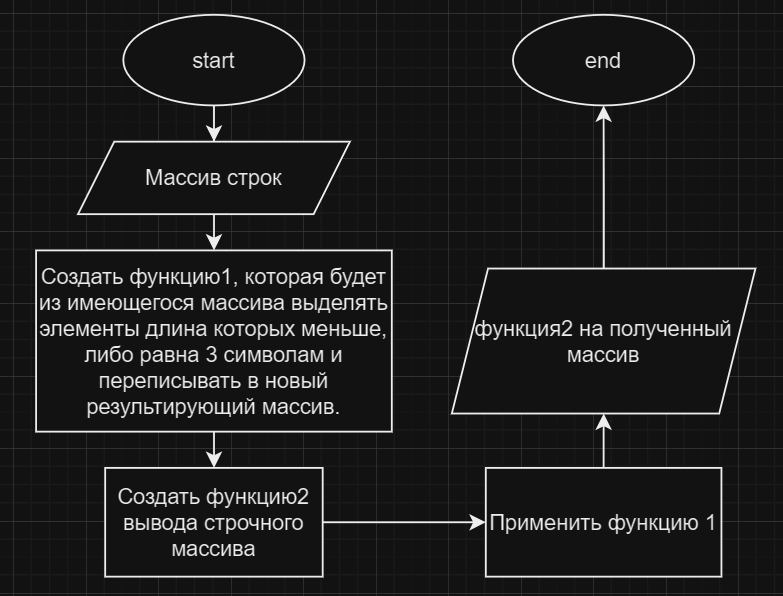

## Итоговая контрольная работа по основному блоку

    Задача: Написать программу, которая из 
    имеющегося массива строк формирует новый массив 
    из строк, длина которых меньше, либо равна 3 символам. 
    Первоначальный массив можно ввести с клавиатуры, либо задать 
    на старте выполнения алгоритма. 
    При решении не рекомендуется пользоваться коллекциями, 
    лучше обойтись исключительно массивами.

*Блок схема теории решения:*

**Ход решения:**
1. Получен строчный массив с консоли
2. Написана функция, которая в строчном массиве выделяет и записывает в новый массив элементы, длина которых равна или меньше 3.
3. Написана функция вывода массива
4. Применены функции. Результат получен
